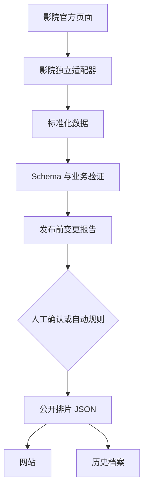

# NYC Repertory Cinema Week — 项目需求与路线图

**状态：** 长期项目规划稿  
**产品语言：** 中文优先，电影原名保留  
**时区：** `America/New_York`  
**当前网站：** https://nyc-rep-cinema-week.wyzmanto.chatgpt.site

## 1. 项目目的

这是一个纽约艺术影院与 repertory cinema 的每周排片聚合网站。它要帮助用户快速回答三个问题：

1. 这周有什么值得看的电影？
2. 哪家影院、哪一天、几点放映？
3. 我在哪里查看官方信息或购票？

它不是覆盖所有商业院线的通用搜索引擎。产品价值来自：精选影院范围、清晰的时间组织、可靠数据、简洁中文简介，以及对特别场次的准确标记。

## 2. 当前范围

### 2.1 首批影院

| 影院 | 官方入口 | 初步抓取判断 |
| --- | --- | --- |
| Metrograph | https://metrograph.com/film/ | 页面结构复杂；可能需要详情页跟进或浏览器渲染 |
| Film Forum | https://filmforum.org/ | 服务端 HTML 相对稳定，适合直接解析 |
| IFC Center | https://www.ifccenter.com/ | 官方主页含按日排片表，适合直接解析 |
| Roxy Cinema New York | https://www.roxycinemanewyork.com/now-showing/ | 官方 Now Showing 页面含场次、简介与票务链接 |
| Paris Theater | https://www.paristheaternyc.com/ | 动态日期选择器；需要解析页面数据或保留人工复核 |
| Film at Lincoln Center | https://www.filmlinc.org/ | ... |
| Syndicated Bar Theater Kitchen | https://syndicatedbk.com/ | ... |


未来可以扩展到 BAM、Museum of the Moving Image、Anthology Film Archives、Quad Cinema 等，但不属于第一阶段完成标准。

### 2.2 当前原型已有功能

- 七天排片页面
- 日期标签切换
- 影院多选筛选
- 电影名与影院搜索
- 按上午、下午、晚间、深夜聚类
- 中文简短电影简介
- 官方详情／购票链接
- 手机与桌面响应式布局
- 公开分享链接

### 2.3 当前原型的主要限制

- 2026-08-11 原型排片已从 UI 组件分离到独立数据文件，并通过 TypeScript 标准化层渲染；这些恢复自线上 bundle 的旧记录仍未逐条完成官方来源验证。
- 不能自动进入下一周。
- 数据已有统一类型和验证状态，但旧记录缺少可靠的逐条抓取时间，统一标记为 `needs_review` 且 `fetchedAt: null`。
- 没有抓取失败报告或发布前 diff。
- 简介和场次数据尚未完全分层。
- 没有历史排片档案。

## 3. 核心用户体验

### 3.1 首页

首页默认显示当前有效的七天窗口，并提供：

- 日期切换
- 影院筛选
- 搜索
- 时间段聚类
- 当天总场次数
- 每张卡片的时间、影院、片名、简短简介、格式／特别活动标签和官方链接
- 数据最后更新时间

### 3.2 时间段定义

建议默认值如下，并保留为配置项：

| 时间段 | 本地开场时间 |
| --- | --- |
| 上午 | 12:00 AM–11:59 AM |
| 下午 | 12:00 PM–4:59 PM |
| 晚间 | 5:00 PM–8:59 PM |
| 深夜 | 9:00 PM–11:59 PM |

### 3.3 电影与场次

同一电影可以有多个场次。以下差异不能被错误合并：

- 不同影院
- 不同日期或时间
- 不同放映格式（35mm、70mm、DCP 等）
- 普通场与 Q&A／intro／members-only／open-caption 场
- 不同官方票务链接

## 4. 数据可信度原则

这是项目最高优先级。

1. **官方来源优先。** 场次必须来自影院官方页面或影院官方票务页面。
2. **禁止猜测。** 不能根据电影档期、相邻日期或搜索摘要补出看似合理的时间。
3. **每条场次可追溯。** 必须保存来源链接和抓取时间。
4. **解析不确定时不发布。** 将记录标为需要人工确认。
5. **简介与排片事实分离。** AI 可以压缩简介，但不得修改时间、日期、影院或活动属性。
6. **保留官方特殊信息。** Q&A、嘉宾、胶片格式、字幕与会员限制会影响用户选择。
7. **显示新鲜度。** 页面明确写明最近更新时间；过期数据不能继续伪装为本周数据。

## 5. 建议数据模型

### 5.1 `Cinema`

```ts
type Cinema = {
  id: string;
  name: string;
  officialUrl: string;
  scheduleUrl: string;
  timezone: "America/New_York";
  enabled: boolean;
};
```

### 5.2 `Film`

```ts
type Film = {
  id: string;
  canonicalTitle: string;
  displayTitle: string;
  year: number | null;
  director: string | null;
  runtimeMinutes: number | null;
  descriptionZh: string | null;
  descriptionSource: string | null;
};
```

### 5.3 `Showing`

```ts
type Showing = {
  id: string;
  cinemaId: string;
  filmId: string;
  startsAt: string;              // ISO 8601 with New York offset
  localDate: string;             // YYYY-MM-DD in America/New_York
  localTime: string;             // HH:mm
  format: "35mm" | "70mm" | "16mm" | "DCP" | "4K DCP" | null;
  eventType: "standard" | "qa" | "intro" | "members_only" | "open_caption" | "other";
  eventNote: string | null;
  detailUrl: string;
  ticketUrl: string | null;
  availability: "available" | "sold_out" | "unknown";
  sourceUrl: string;
  fetchedAt: string;
  extractionStatus: "verified" | "needs_review" | "manual";
};
```

### 5.4 原始证据

每次更新应保留最少的审计信息：

```ts
type SourceSnapshot = {
  cinemaId: string;
  fetchedAt: string;
  sourceUrl: string;
  contentHash: string;
  parserVersion: string;
  result: "success" | "partial" | "failed";
  error: string | null;
};
```

原始 HTML 可以短期保存在构建产物之外，用于调试；不要直接公开，也不要无限期无治理地积累。

## 6. 系统结构



### 6.1 抓取层

每家影院拥有独立 adapter，例如：

```text
src/ingestion/adapters/
  film-forum.ts
  ifc-center.ts
  roxy-cinema.ts
  metrograph.ts
  paris-theater.ts
```

Adapter 只负责从该影院官方来源提取候选数据。共享逻辑负责：

- 日期和时间标准化
- 时区处理
- 电影名清洗
- 去重
- 活动与格式标签解析
- Schema 验证
- 来源与抓取状态记录

当前实现状态（2026-08-11）：Film Forum 已使用官方 `my.filmforum.org` 日历 JSON 接口实现首个 adapter。该接口提供带纽约 UTC offset 的明确时间、稳定 performance ID、售票状态和直接购票链接。IFC Center adapter 使用官网服务端 HTML 中的明确 AM/PM、影片详情页和 ticket event ID；特别活动只有在日期、片名和时间唯一匹配时才并入场次。Roxy Cinema adapter 使用官网 Now Showing 卡片的 offset 时间和 Veezi purchase ID，保留片名中的胶片格式，并仅把带明确日期的 introduction 应用于相同日期。Metrograph adapter 使用官网电影卡片、Vista session ID 和格式 metadata；无年份日期只在请求窗口内唯一匹配时采用，sold-out 场次保留但不虚构 ticket URL。任一页面结构变化或零记录异常都会返回 `failed`／`partial`，不会静默发布。

### 6.2 获取策略优先级

1. 官方公开 JSON／页面内结构化数据
2. 官方服务端渲染 HTML + HTML parser
3. 官方详情页跟进
4. 浏览器渲染
5. 人工 override

不要因为一种策略失败就改用非官方聚合数据并静默发布。

### 6.3 人工覆盖

建议提供受版本控制的人工修正文件：

```text
data/manual-overrides/YYYY-MM-DD.json
```

每条人工记录也必须包含官方 `sourceUrl`、录入原因和录入时间。下周不应自动继承旧 override。

## 7. 每周更新流程

### 推荐的第一版：自动整理，人工确认

1. 按固定时间运行抓取。
2. 输出本周候选数据和影院级状态。
3. 与当前线上数据比较。
4. 生成 review report：新增、删除、时间变化、链接变化、解析失败、异常数量波动。
5. 用户或维护者确认。
6. 生成公开 JSON 并部署。
7. 保存上周数据到 archive。

完全自动发布应在每家影院连续稳定运行数周后再启用。

### 更新频率建议

- 每周主更新：一次
- 周末前增量检查：一次（可选）
- 单影院失败：继续保留其他影院更新，但页面必须显示该影院数据状态，不能把旧数据当作最新数据

## 8. 验证规则

至少实现以下自动检查：

- `localDate` 位于当前发布窗口内
- `startsAt` 与 `localDate`/`localTime` 一致
- `cinemaId` 存在于配置中
- `sourceUrl` 属于对应影院的允许域名
- 电影名非空且不为 placeholder
- 同一影院、同一电影、同一时间的重复场次被识别
- 相同时间但不同格式／活动标签的场次不被误删
- 每家影院记录量相对上一周异常下降时报警
- 官方页面抓取失败时禁止把空数组解释为“本周无排片”
- 数据超过规定新鲜度时阻止发布或显示醒目警告

## 9. 发布前报告

Review report 至少包含：

```text
IFC Center: success, 126 showings, +14 / -9
Film Forum: success, 73 showings, +6 / -12
Roxy Cinema: partial, 18 showings, 2 need review
Metrograph: failed, selector not found
Paris Theater: manual review required
```

并列出：

- 新电影／新场次
- 被删除的场次
- 时间或票务链接变化
- 特别活动变化
- 所有 `needs_review` 记录

## 10. 分阶段路线图

### Phase 0 — 接管现有项目

- 检查当前 repository 结构和部署方式
- 确认原型源码与线上版本一致
- 记录现有硬编码数据的位置
- 补充运行、构建和测试说明
- 确认“本周”的日期定义

### Phase 1 — 数据与 UI 解耦

- 建立 TypeScript schema
- 把硬编码排片移到独立 JSON／TS 数据文件
- 保持当前 UI 行为和视觉不变
- 添加时间排序、去重和时区测试
- 页面显示最后更新时间

**完成标准：** 替换一个数据文件即可更新整周网站，不必修改页面组件。

### Phase 2 — 可验证的抓取

- Film Forum adapter
- IFC Center adapter
- Roxy Cinema adapter
- Metrograph adapter
- Paris Theater adapter
- 统一验证和 provenance
- 人工 override
- review report

**完成标准：** 五家影院均能输出已验证数据，失败时不会发布虚假或空白结果。

Implementation note (2026-08-11): the first six official-source adapters are
now implemented. Paris Theater showtimes come from its official digital API
and are joined to its official CMS by Vista film ID. The adapter discovers the
current public client configuration from the theater's own layout bundle at
runtime and never persists or logs those values. Special-event copy is joined
only when the CMS ticket link contains the exact showtime ID; failed joins are
excluded or flagged for review rather than inferred from a shared date.

Film at Lincoln Center uses its official `api.filmlinc.org/showtimes` feed for
offset-bearing New York datetimes, performance and production IDs, venues,
ticket URLs, accessibility, and ticket status. Each in-window film is joined by
official slug to its WordPress GraphQL record for director, year, runtime,
presentation format, synopsis evidence, and performance-ID-scoped Q&A/intro
metadata. Standby-only screenings remain visible with a sold-out label and
explicit standby note. Synthetic pass products are excluded. A missing detail
join, inconsistent ID/time/link, or empty feed becomes a visible partial/failed
result and blocks publication.

The pre-publication review report compares serialized ingestion bundles by
stable showing ID. It lists new, removed, and factually changed records, and
places publication on hold for failed/partial feeds, parser warnings, duplicate
IDs, unverified records, missing or empty cinemas, and upcoming-showing-count
drops over 25%. Already-finished screenings remain listed as removals but do not
trigger the volume alarm when an official site stops returning past events. The
threshold is a review trigger, not an automatic factual judgment.

The public header derives its year, cinema count, and localized date range from
schedule metadata. Newly generated bundles use the confirmed Monday–Sunday
calendar-week rule.

Product decisions confirmed 2026-08-11:

- “This week” is the New York calendar week from Monday through Sunday.
- A successful review report requires explicit named human approval before any
  publication step. There is no automatic publication.
- Sold-out events remain visible and carry a clear sold-out label.

The recovered August 11–17 prototype bundle predates the calendar-week decision
and remains unchanged as historical evidence. Newly generated bundles must use
the Monday–Sunday rule.

The weekly candidate command accepts any New York local anchor date, computes
its Monday–Sunday window, runs all six implemented official adapters, and
writes a new file without overwriting an existing candidate. It does not review,
approve, or publish; those remain explicit subsequent stages.

Implementation note (2026-08-11): the compiler now merges adapter results and
week-scoped manual overrides into normalized public JSON, validates and
deduplicates all facts, and projects the compiled result into a review bundle.
Review reports contain a SHA-256 candidate digest. Promotion recompiles the
candidate and refuses to write public data unless a named approval contains the
same digest. The first August 10–16 report contains 342 showings and zero
concerns. Yuzhen Wang approved its digest, and the guarded local promotion
completed after separate publication authorization. The normalized frontend
data now contains that approved schedule; tests and the production build pass.

Storage decision confirmed 2026-08-11: Supabase PostgreSQL is the durable system
of record. Normalized cinema, film, showing, weekly publication, ingestion,
source snapshot, override, review, and approval records are relational. Exact
workflow JSON is retained separately in `workflow_artifacts`. The public site
does not connect to PostgreSQL; it uses a validated static JSON export of the
current approved week. Database import is transactional and digest-verified.
All server-managed tables have RLS enabled with no browser policy, and privileges
are revoked from Supabase anonymous and authenticated API roles.

Automation decision updated 2026-08-11: clean weekly runs with zero review
concerns may receive a distinct `auto_approved` decision and continue through
database import, static export, tests, build, and Vercel deployment. Any failed
feed, unresolved warning, questionable change, validation error, database
failure, round-trip mismatch, test failure, or build failure stops the workflow,
keeps the previous site active, uploads private review artifacts, and creates a
GitHub Issue for manual investigation. This replaces mandatory human approval
for every clean week; manual approval remains available for reviewed exceptions.

Schedule decision updated 2026-08-11: the weekly workflow runs at the end of
Sunday, expressed as Monday 00:00 in `America/New_York`. The Monday execution
date anchors the new Monday–Sunday calendar week.

Chinese-description decision confirmed 2026-08-11: concise AI-assisted Chinese
copy may be used when it is grounded in an official cinema detail page or a
trusted film source. Approved copy is cached by film and reused across weekly
runs; every non-empty `descriptionZh` must carry a valid HTTPS
`descriptionSource`. Description enrichment is separate from showtime facts and
cannot modify dates, times, formats, events, availability, or ticket links.

Description automation implemented 2026-08-11: the weekly workflow first reuses
approved PostgreSQL or curated descriptions. Only uncached films are sent to the
OpenAI Responses API, together with text extracted from their official cinema
detail pages. Structured output must either return one bounded Chinese sentence
or explicitly request review. Insufficient official evidence, an API failure,
model refusal, missing results, or invalid copy blocks publication and opens the
existing manual-review Issue path. Generated copy is persisted by the approved
database import and is not regenerated on later weeks.

### Phase 3 — 每周工作流

- 设置每周定时执行
- 保存抓取日志与报告
- 选择人工批准或自动发布
- 部署成功检查
- 失败通知

**完成标准：** 连续四周不需要修改前端代码即可更新排片。

### Phase 4 — 长期产品能力

- 上周／下周与历史档案
- 电影详情页
- 新增场次区块
- 地图和影院信息
- 35mm／70mm／Q&A 等标签筛选
- 一键加入 Google／Apple Calendar
- 收藏和隐藏影院（本地存储即可起步）
- “本周值得看”的编辑推荐

### Phase 5 — 账号、个人计划与共享频道

Product scope confirmed 2026-08-11:

1. Users can create an account and sign in. Anonymous visitors can continue to
   browse the public official schedule without an account.
2. A signed-in user can privately mark one specific official showing they want
   to attend. Marking another time or cinema for the same film creates a separate
   mark. Private is the default; creating a mark must never publish it implicitly.
3. A user can create a channel and invite friends. A channel member can see
   marks that another member explicitly shared into that channel, but cannot
   edit or delete another user's mark.
4. When creating a new mark, the owner may leave it private or share it into one
   or more channels they belong to. The owner can also change the sharing choice
   later without changing the underlying official film or showing.
5. If an event is missing from the official cinema catalog, a signed-in user can
   create a user event with manually entered title/content and New York date and
   time. It can remain private or be shared into channels under the same rules.

The initial collaboration model is intentionally closer to a shared drive than
to a public social network: channel membership grants visibility to explicitly
shared items, not ownership. Only the creator can edit the underlying mark or
user event. Channel members must not be able to edit another member's content.

#### Data and trust boundaries

- Official `Film` and `Showing` records remain read-only products of the
  evidence-backed ingestion and approval workflow.
- User-created events live in a separate table and must display a clear
  “用户创建” label. They must never receive `verified` extraction status or be
  merged into the official schedule dataset.
- Personal marks, user events, memberships, invitations, and shares are dynamic
  application data stored in Supabase PostgreSQL; they are not exported into the
  public weekly JSON.
- The browser may use the Supabase authenticated client only for user-scoped
  data protected by Row Level Security. `DATABASE_URL` and service-role secrets
  remain server-only.
- Every personal item is private unless the owner creates an explicit share
  record for a channel. Removing a share must not delete the underlying item.

Proposed relational shape (names may be refined during implementation):

```text
profiles                one application profile per auth.users identity
channels                channel metadata and creator
channel_members         membership and role per channel/user
channel_invitations     expiring invitation state
watch_marks             user-owned mark referencing one exact official showing
user_events             user-owned manually entered event
channel_mark_shares     explicit channel visibility for a watch mark
channel_event_shares    explicit channel visibility for a user event
channel_invite_links    revocable link tokens stored only as hashes
channel_guests          channel-scoped guest name and hashed access code
```

Required authorization invariants:

- users can create, read, update, and delete only their own marks and user events;
- channel members can read an item only while it is explicitly shared to a
  channel in which they have active membership;
- shared visibility never grants update/delete rights to the viewer;
- users can share only their own item and only to a channel they belong to;
- accepting an invitation must bind the authenticated identity, not merely trust
  a client-supplied user ID;
- deleting a channel or membership must revoke channel-derived visibility;
- a schedule refresh must preserve the stable showing reference used by an
  existing mark, even if that showing is later removed or cancelled upstream;
- RLS policies and database constraints are tested before enabling the feature.

#### Channel roles and invitation paths

Channel roles confirmed 2026-08-12:

- `owner` can rename/delete the channel, create or revoke invitations, and remove
  members or guests;
- `member` can view channel content, share or unshare only their own items, and
  leave voluntarily;
- there is no admin role in v1;
- leaving immediately revokes the user's channel access and removes that user's
  shares from the channel without deleting their private marks or events.

Two invitation paths are required:

1. **Direct account invitation.** The owner can target an existing account by
   exact username, private email, or a random unique Friend ID. Username and
   Friend ID are public identifiers. Email matching happens only in trusted
   server code and must not reveal registered email addresses or allow account
   enumeration. A Friend ID is independent from username, contains no personal
   information, and can be regenerated to invalidate the old value.
2. **Revocable invitation link.** An authenticated visitor accepts the invite
   into their existing account. An unauthenticated visitor is offered account
   registration or guest access. Registration resumes the pending invitation
   after authentication. Guest access asks for a channel-visible temporary name,
   creates a guest scoped to that one channel, and displays a separate access
   code that can reopen only that channel.

Invitation-link tokens and guest access codes are bearer credentials. They must
be generated with cryptographic randomness, shown only when necessary, stored
only as hashes, rate-limited on verification, expire or be revocable, and never
appear in analytics or application logs. A guest code cannot query profiles,
discover channels, reuse normal authenticated RLS access, or enter any channel
other than the one encoded in its server-validated guest record.

Confirmed v1 guest boundary: guests are read-only.
They can view the channel member names and shared items, but cannot create watch
marks, share content, create user events, invite others, or modify the channel.
Registering converts their place in that channel into a normal `member` without
making the guest code a general account credential.

Invitation links expire seven days after creation and allow at most 20
successful joins. The channel owner can revoke a link before either limit.

Recommended delivery order:

1. Supabase Auth, profile creation, session handling, and protected account UI.
2. Private watch marks for exact official showings.
3. Channels, membership, and invitations.
4. Explicit mark sharing and a read-only channel activity view.
5. Private user-created events, then explicit channel sharing.
6. Notifications and convenience features only after authorization tests pass.

Open decisions to confirm before implementation reaches each boundary:

- whether user-created events may omit an end time, location, or external URL;
- whether channel members can react/comment, which is outside the confirmed
  read-only sharing requirement.

Implementation note (2026-08-12): the account foundation now has a database
migration for owner-scoped `profiles` and exact-showing `watch_marks`, with RLS,
unique marks per user/showing, and a restrictive composite foreign key to
`showings(window_start, id)`. Weekly imports preserve stable showing rows by
marking missing records as `removed` and upserting current records as `active`;
the public export includes only active records. Account UI, authentication, and
private showing-level marks are implemented. The channel database foundation is
also deployed: random Friend IDs, owner/member membership, direct username or
Friend-ID invitations, hashed seven-day/20-use links, and hashed channel-scoped
guest credentials all use deny-by-default RLS and controlled functions. Channel
guest/email database endpoints and database-backed attempt limits are deployed,
and the matching Edge Function source is ready for deployment. Owner/outsider
and service-role authorization tests pass with all test data rolled back.
The Edge Function is deployed and the first Channel UI is implemented: signed-in
users can create channels, see their Friend ID, invite by username/Friend ID/email,
create link invitations, and accept pending invitations. Link visitors can join
an account or create a read-only guest, save the one-time guest credential, and
later reopen only that channel. Sharing and user-created events are not yet
implemented; a second registered test identity is still required for a complete
two-account acceptance test.

Channel navigation uses a Discord-like left rail on desktop so shared planning
remains available beside the weekly schedule. On narrow screens it becomes a
button-triggered drawer with a backdrop, preserving the full width of film cards.
Channel creation gives immediate progress/success/error feedback and rejects
case-insensitive duplicate names owned by the same user, including concurrent
double submissions. Existing duplicates are never deleted automatically; owners
can remove a channel through an explicit confirmed delete action.
Async Channel forms retain their form element before awaiting Supabase so a
successful write always proceeds to local reset, refresh, selection, and visible
confirmation without requiring a page reload.

Authentication decision confirmed 2026-08-11: v1 uses a unique public username
plus a private email-and-password Supabase Auth identity. Email is used only for
authentication, verification, and account recovery; it is never exposed in
profiles or channel views. The application does not collect real name, phone,
birthday, contacts, or address. Passwords require at least eight characters and
are hashed and verified by Supabase Auth. Channel invitations will use revocable
links so members do not need to disclose email addresses to one another.
Signed-in users can change their password by providing the current password and
a distinct confirmed new password of at least eight characters. Password values
are sent only to Supabase Auth and are never stored in application tables.

Watch-mark implementation note (2026-08-12): each public showing card now has a
private “想看” toggle. A signed-in user's exact-showing marks are loaded from
Supabase for the published week, persist across browser sessions, and can be
removed only by their owner under RLS. The UI reports the user's marked-showing
count and opens the account dialog when an anonymous visitor attempts to mark a
showing. No mark is shared to a channel in this phase.

## 11. 第一轮 Codex 任务清单

将下面内容作为新 agent 的第一个执行队列：

```text
1. Read AGENTS.md and docs/PROJECT_SPEC.md completely.
2. Inspect the repository without editing it.
3. Report the current architecture, commands, hard-coded data locations,
   deployment setup, test coverage, and any differences from the spec.
4. Propose the smallest implementation for Phase 1.
5. After approval, move schedule data out of the UI component and add a typed
   schema without changing visible behavior.
6. Add tests for New York time parsing, chronological sorting, noon/midnight,
   deduplication, and preservation of special-event variants.
7. Run the existing build and tests, then summarize changed files and remaining
   risks.
```

## 12. 产品决定

已确认：

1. “本周”是自然周（周一至周日）。
2. 每周更新必须先生成 review report，再由具名用户明确批准；不自动发布。
3. 已售罄场次继续显示并明确标注。
4. 产品需要用户账号、私人想看标记、受邀请成员可见的共享频道，以及可选择共享的用户自建活动。
5. 分享只授予频道成员查看权；其他成员不能编辑标记或活动，默认状态始终为私人。
6. “想看”标记针对一个具体官方场次；同一电影的不同时间或影院分别标记。
7. 首版账号对外仅显示唯一 username；邮箱只用于 Supabase 登录、验证和找回，密码至少 8 位，不收集其他个人资料。
8. Channel 首版只有 owner/member；支持通过 username、私密邮箱、随机 Friend ID 直接邀请，也支持可撤销链接。
9. 未登录访客可选择注册，或用临时名字成为仅限该 Channel 的 guest，并获得只访问该 Channel 的独立代码。
10. Guest 首版只读；邀请链接默认 7 天后过期，最多允许 20 人成功加入，owner 可随时提前撤销。

尚未确定、需要向用户确认：

1. 下一批扩展影院的优先顺序是什么？

## 13. 非目标

在核心每周更新稳定前，不做以下扩张：

- 覆盖所有 NYC 商业影院
- 超出已确认频道共享范围的复杂社交功能，例如公开动态流、私信、评论和关注关系
- 用户评论系统
- 付费或订阅体系
- 为了“看起来完整”而接入来源不明的排片聚合数据
- 在没有实际需求前提前建设复杂数据库和后台管理系统

## 14. 成功标准

这个项目成功，不是因为页面收录的电影最多，而是因为：

- 用户能在一分钟内找到合适的场次；
- 每条排片都能回到官方来源；
- 每周更新不需要改前端代码；
- 单家影院抓取失败不会污染其他数据；
- 维护者能快速看懂变化并安全发布；
- 网站连续运行数月后仍然清晰、准确、可扩展。
